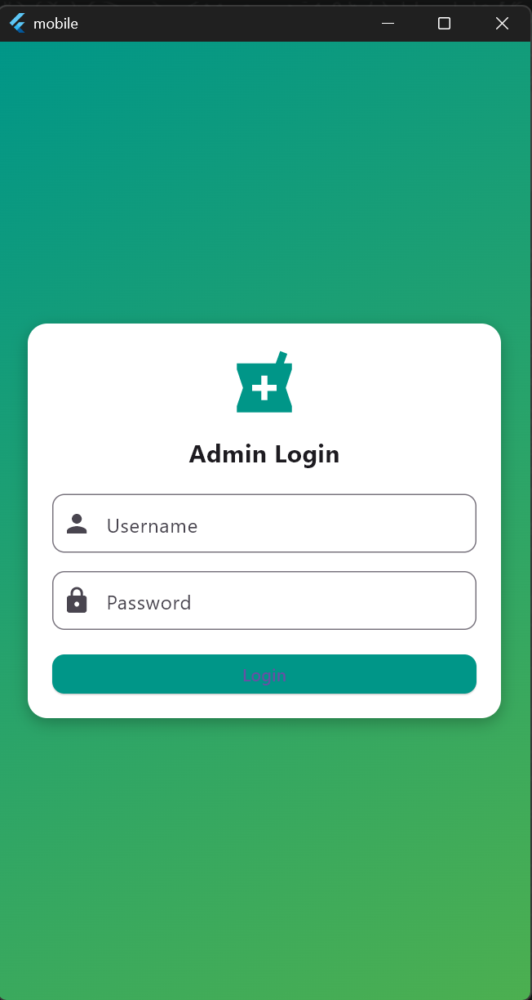
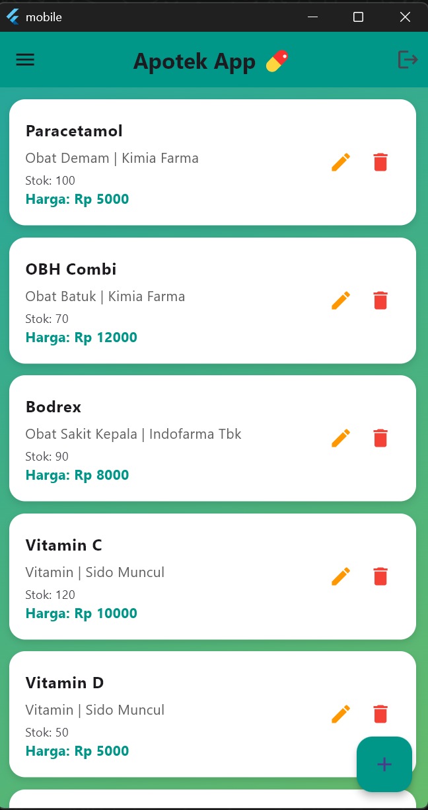
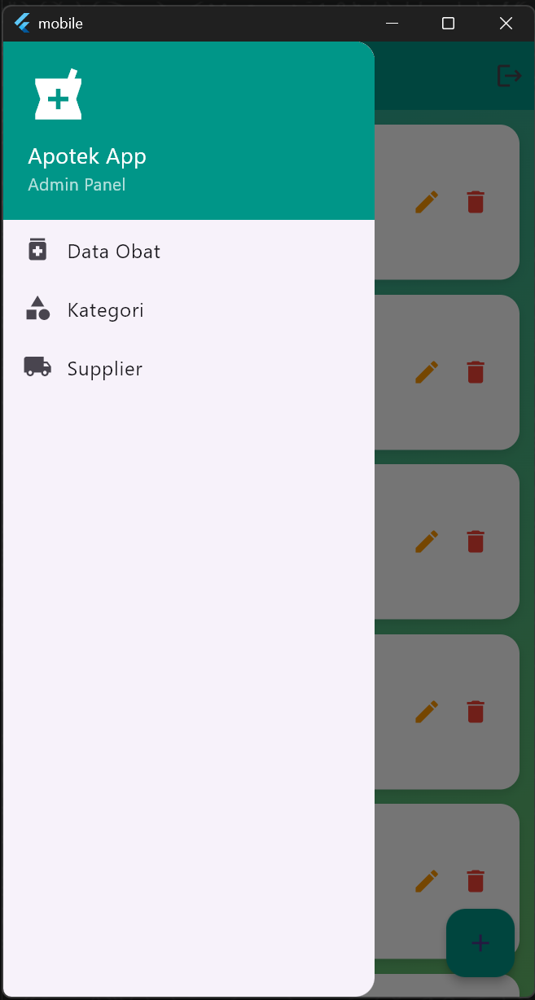
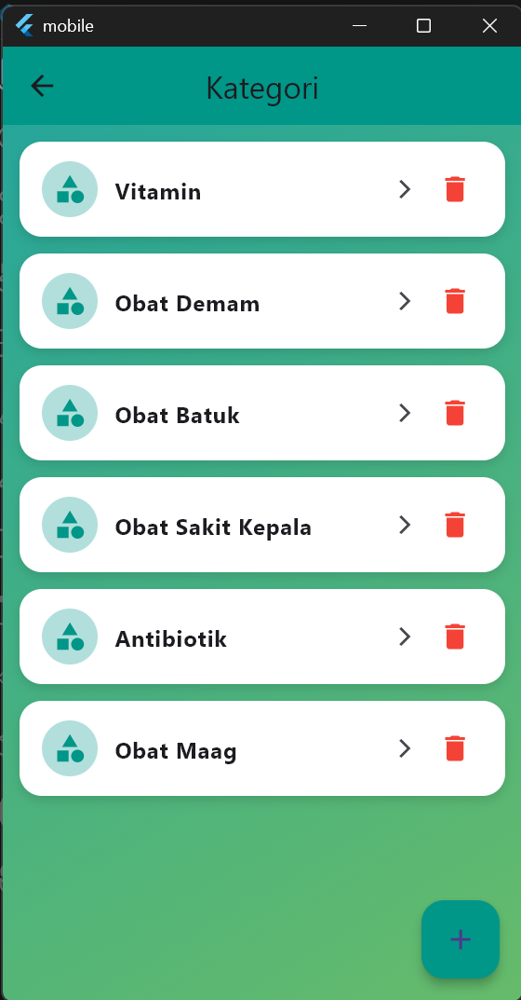
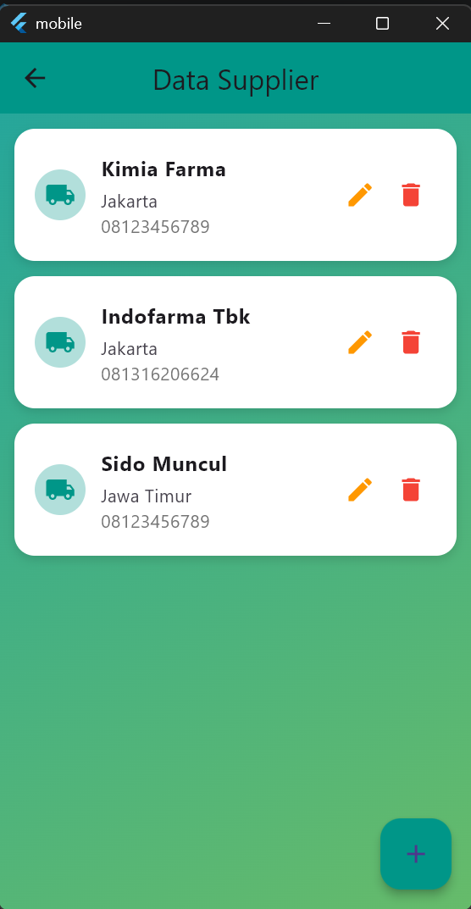
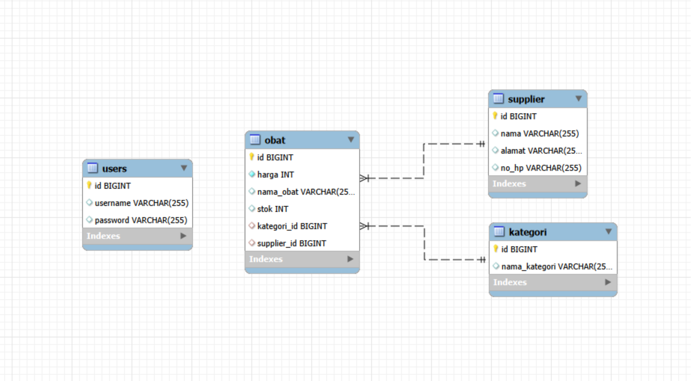

# 💊 Pharmacy Admin Dashboard (Mobile App)

## ✨ Highlights

- Mobile-based admin dashboard
- Full CRUD system (medicine, category, supplier)
- Category-based filtering system
- REST API integration with Spring Boot

---

## 📖 Description

A mobile-based admin dashboard application for pharmacy management built using Flutter and Spring Boot.

This application is designed for **admin use only**, allowing full control over medicines, categories, and suppliers.

---

## 🏗️ Architecture

- 📱 Frontend: Flutter
- ⚙️ Backend: Spring Boot (REST API)
- 🗄️ Database: MySQL (Laragon)

---

## 🔐 Authentication

- Admin login required to access the system

---

## 🚀 Features

### 💊 Medicine Management

- View all medicines
- Add new medicine
- Edit medicine data
- Delete medicine

---

### 🏷️ Category Management

- View categories (Vitamin, Fever, Cough, etc.)
- Add new category
- Delete category
- Filter medicines based on selected category

---

### 🏢 Supplier Management

- Add supplier
- Edit supplier
- Delete supplier

---

## 🔍 Advanced Features

- Dynamic filtering of medicines by category
- Real-time data synchronization with backend API
- Mobile-based admin control system

---

## 🧠 Example Use Case

Admin selects "Vitamin" category →  
Only vitamin-related medicines are displayed →  
Admin can manage filtered data efficiently

---

## 🔄 System Flow

1. Admin logs in
2. Dashboard is displayed
3. Admin manages:
   - Medicines
   - Categories
   - Suppliers

---

## 🛠️ Tech Stack

- Flutter (Mobile Development)
- Spring Boot (Backend API)
- MySQL (Database)

---

## ⚙️ How to Run

### 🔹 Backend (Spring Boot)

```bash
./mvnw spring-boot:run
```

Runs on:

```bash
http://localhost:8080/api/{endpoint}
```

### 🔹 Mobile App (Flutter)

```bash
flutter pub get
flutter run
```

## 📌 Notes

- This project is focused on admin dashboard functionality
- Category update (edit) feature is not implemented yet
- Backend must be running before using the mobile app

## 📸 Screenshots

### Login Session

<p align="center">
  
</p>

### Data Medicine

<p align="center">
  
</p>

### Sidebar Session

<p align="center">
  
</p>

### Category Session

<p align="center">
  
</p>

### Supplier Information

<p align="center">
  
</p>

### ERD Diagram

<p align="center">
  
</p>

---

## 👨‍💻 Author

Affan Baihaqi
